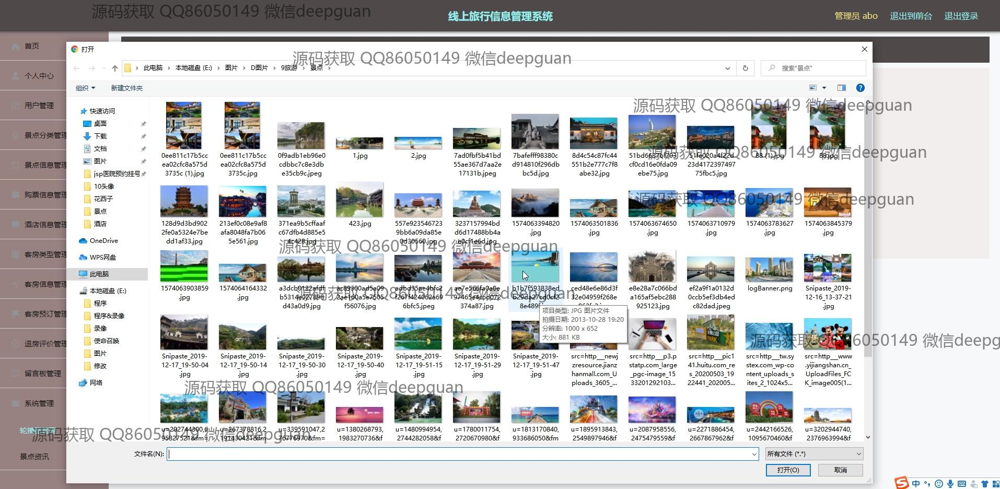

<h1 align="center">线上旅行信息管理系统+vue</h1>

## 简介
线上旅行信息管理系统：角色分为管理员、用户；用户信息管理、景点管理、酒店信息管理、购票与订单管理、轮播图管理、评价与留言功能、用户注册与登录。使用SSM和Vue技术构建前后端。    --计算机毕业设计源码；毕设源码；java毕业设计源码

## 联系方式

<h3 align="center">获取完整代码与数据库文件 + 微信：deepguan QQ: 86050149 QQ群: 783742310</h3>

<h3 align="center">可帮忙远程部署 包运行成功！提供远程部署、修改代码、设计文档指导、代码讲解等服务！</h3>

## 功能介绍（完整见运行截图）
管理员：基本功能包括登录、注册、退出，支持景点、酒店、客房信息管理，轮播图管理以及用户信息管理。管理员可通过后台导航栏操作各模块，如添加景点、管理门票信息、维护客户预订记录、上传图片及分类管理，提供直观的统计图表以便于数据分析和决策支持。还可查看留言反馈和评价信息，并执行修改或删除操作。

用户：基本功能包括注册、登录、退出，支持浏览和搜索景点信息、酒店信息以及客房类型。用户可在线预订客房或门票，查看详细的景点介绍、设施及价格信息，并根据需求进行筛选和对比。用户可在个人中心管理订单、查看收藏以及提交评价和留言，提供便捷的旅行计划服务。

游客：无需注册即可访问首页，通过轮播图和推荐内容浏览热门景点、酒店及客房信息。游客可通过分类筛选或搜索功能快速获取目标信息，并在页面内查看图片展示及简要介绍，了解旅行选择和计划参考。

开发人员：支持系统模块扩展与维护，通过文件管理器管理项目资源，结合框架技术高效完成功能开发。开发人员可调试与优化导航、表单交互及富文本编辑器等功能，确保系统界面友好、逻辑清晰，为用户提供流畅的操作体验。

## 运行截图

本代码来源于网络,仅供学习参考使用!

